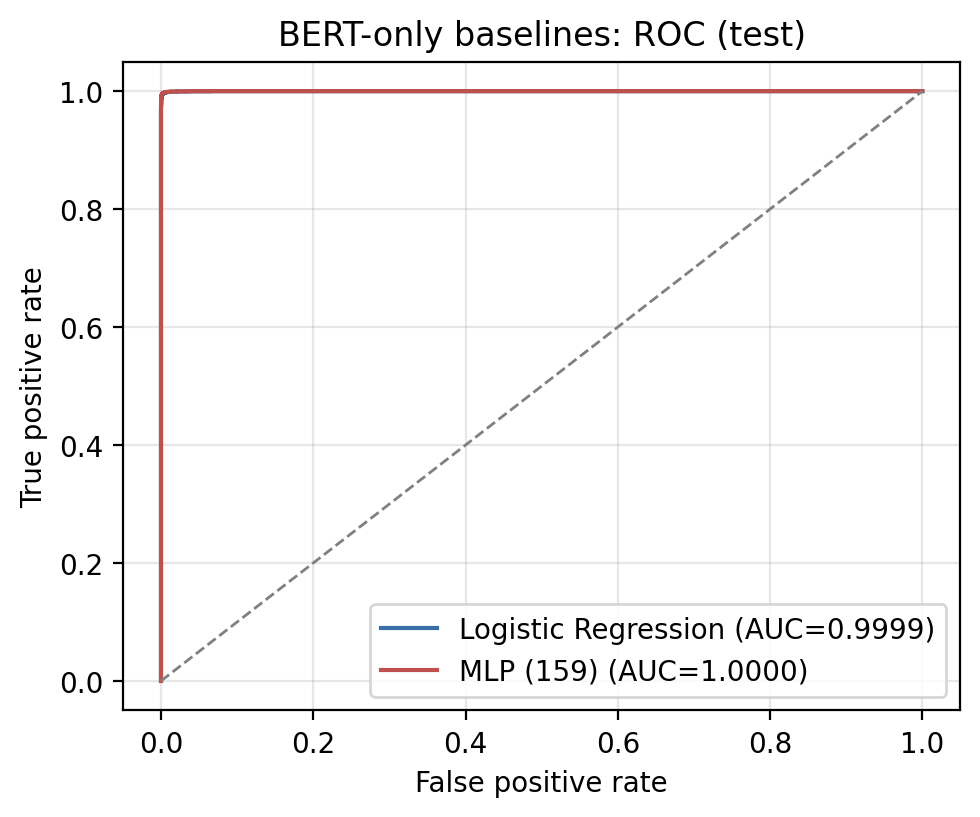
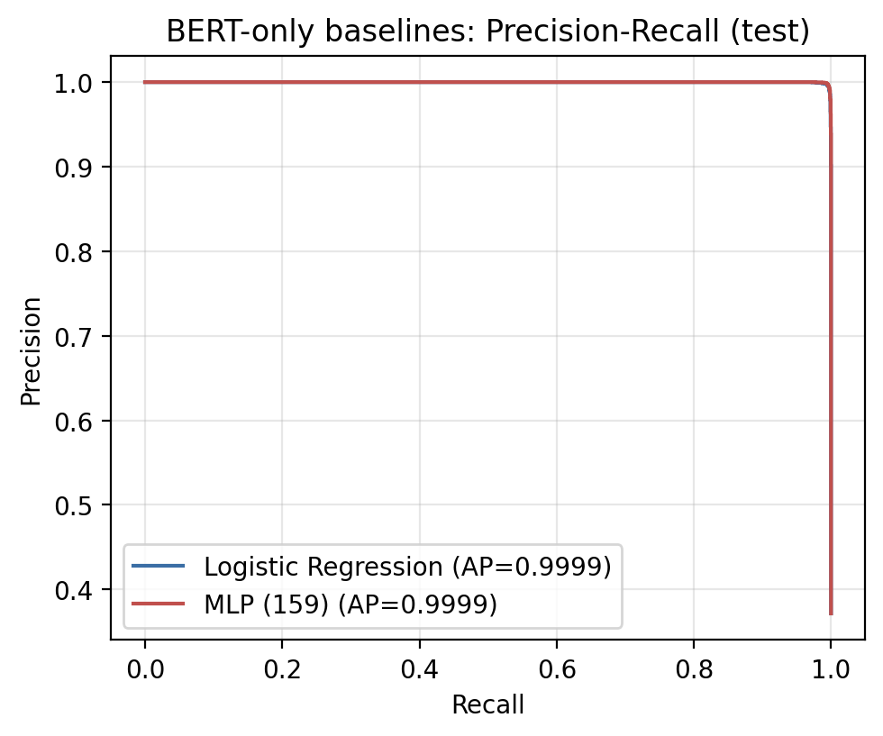

# Ablation: BERT-only baseline (isolating the GNN's contribution)

Same 70/30 split (`test_size=0.30, random_state=42`), the identical 9,276-row test set, and the same `bert-base-uncased` encoder as the BERT-GNN hybrid. The only change is the classifier: BERT's `[CLS]` embedding is fed to a simple head instead of a graph + GNN.

Test set: 9,276 queries (5,830 benign, 3,446 malicious).

| Model | Accuracy (%) | Precision (%) | Recall (%) | F1 (%) | Confusion matrix |
|---|---|---|---|---|---|
| BERT-GNN hybrid (reference) | 99.48 | 99.48 | 99.48 | 99.48 | [[5815, 15], [33, 3413]] |
| BERT [CLS] + Logistic Regression (class_weight=balanced) | 99.66 | 99.68 | 99.39 | 99.54 | [[5819, 11], [21, 3425]] |
| BERT [CLS] + MLP (1 hidden layer, 159 units) | 99.73 | 99.80 | 99.48 | 99.64 | [[5823, 7], [18, 3428]] |

**Finding.** On this near-saturated benchmark the BERT-only baselines match, and marginally exceed, the BERT-GNN hybrid on accuracy, so the GNN component does not add measurable accuracy here. The BERT-only heads are also much cheaper (the logistic-regression head trains in about one second and classifies all 9,276 test queries in around 0.03 seconds). Reproduce with `python bert_only_ablation.py`.

### Confusion matrices

![BERT [CLS] + Logistic Regression](cm_bert_only_logreg.png)
![BERT [CLS] + MLP](cm_bert_only_mlp.png)

### ROC and Precision-Recall (test)

### Comparison across protocols

*(Confusion-matrix and comparison figures: `make_result_figures.py`. ROC/PR: `bert_only_ablation.py`.)*
