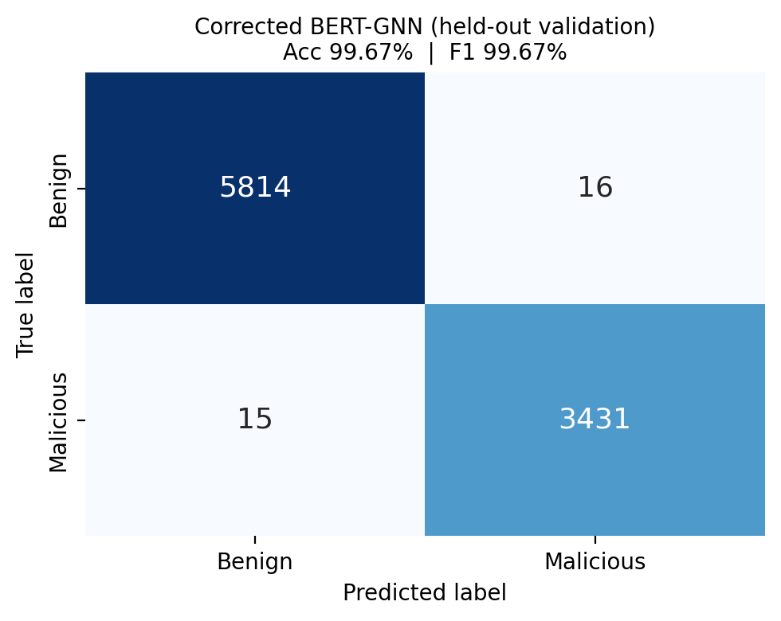
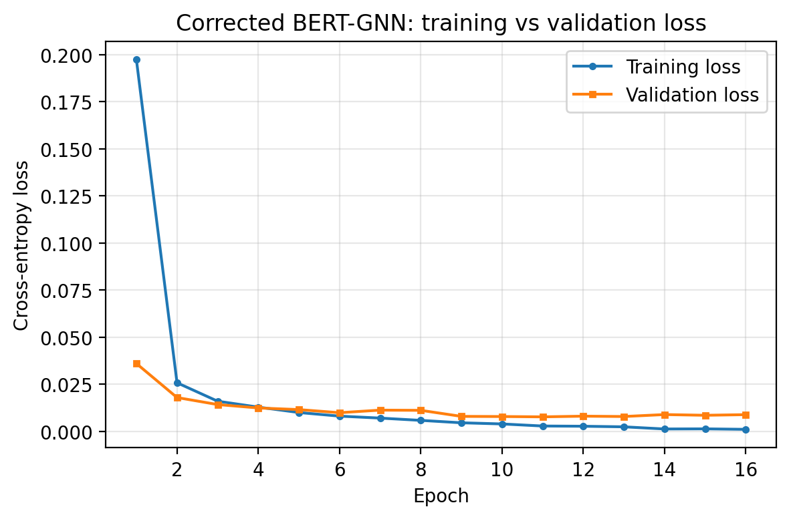
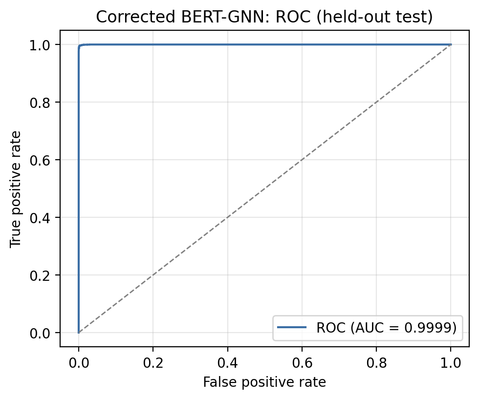
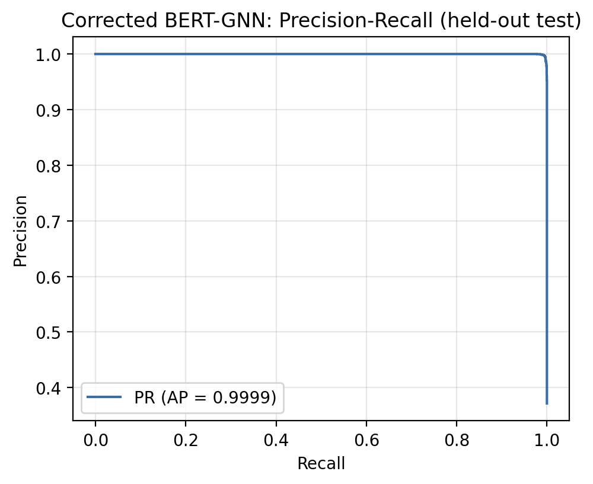

# Corrected BERT-GNN: held-out validation protocol

The original pipeline selected hyperparameters (Optuna, 50 trials) and applied early stopping using the **test** set, then reported on that same test set, so its 99.48% is optimistic. This run keeps the identical outer split (the same 9,276-row test set) but carves a **validation** set from the training portion, runs the hyperparameter search and early stopping on **validation**, and evaluates **once** on the untouched test set. Architecture, graph construction and class-weighted loss are unchanged.

Selected hyperparameters (by validation F1): `{'hidden_dim': 169, 'dropout_rate': 0.15579754426081674, 'lr': 7.52374288453485e-05, 'batch_size': 67}`.

| Protocol | Accuracy (%) | Precision (%) | Recall (%) | F1 (%) | Confusion matrix |
|---|---|---|---|---|---|
| Original (test used for selection) | 99.48 | 99.48 | 99.48 | 99.48 | [[5815, 15], [33, 3413]] |
| Corrected (held-out validation) | 99.67 | 99.67 | 99.67 | 99.67 | [[5814, 16], [15, 3431]] |

### Confusion matrices

### Training vs validation loss, ROC and Precision-Recall (corrected model)

Reproduce the evaluation and figures with `python corrected_bertgnn_retrain.py` (confusion-matrix and comparison figures: `python make_result_figures.py`).
