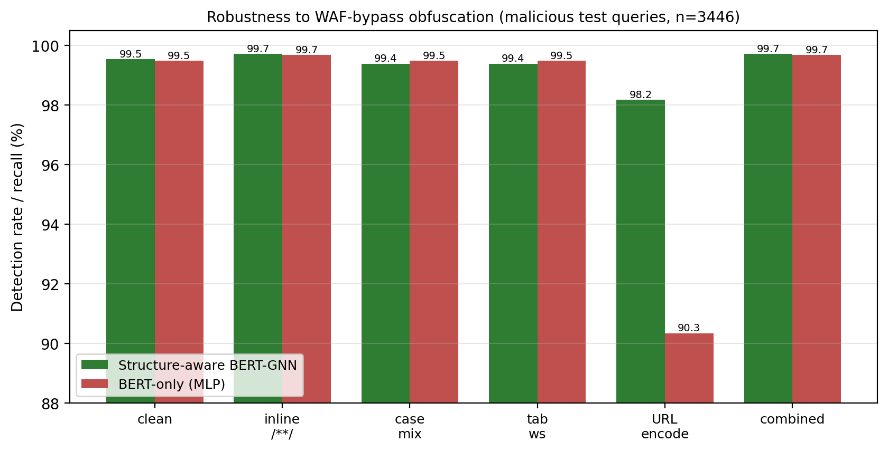

# Evasion-robustness: structure-aware BERT-GNN vs BERT-only

Detection rate (recall) on 3446 malicious test queries under WAF-bypass obfuscations that preserve malicious intent. Higher is better; the smaller the drop from the clean rate, the more robust the model to evasion.

| Obfuscation | Structure-GNN recall (%) | BERT-only recall (%) | GNN more robust |
|---|---|---|---|
| clean | 99.54 | 99.48 | yes |
| inline_comments(/**/) | 99.71 | 99.68 | yes |
| case_mix | 99.39 | 99.48 | no |
| tab_whitespace | 99.39 | 99.48 | no |
| url_encode | 98.17 | 90.34 | yes |
| combined(case+/**/) | 99.71 | 99.68 | yes |

Clean baseline: structure-GNN 99.54%, BERT-only 99.48%.

Reproduce with `python obfuscation_robustness.py`.
