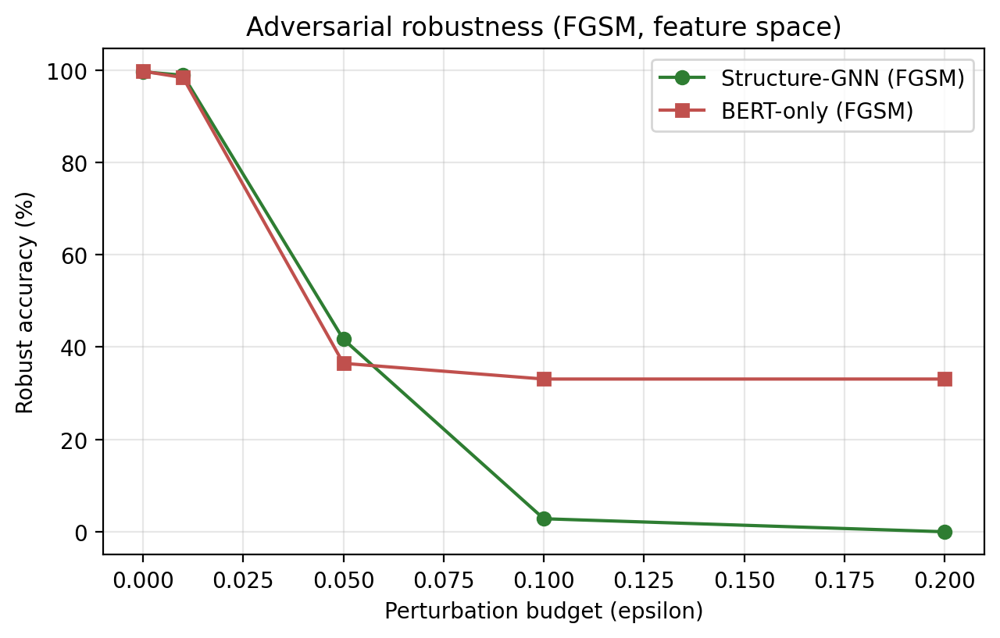

# Robustness test 2: adversarial robustness (FGSM / PGD)

Gradient attacks in the feature space (node features for the structure-GNN, [CLS] for BERT-only), consistent with the sibling DistilBERT paper's FGSM evaluation. Robust accuracy is accuracy on the adversarially perturbed 9,276-query test set; higher is more robust.

| FGSM epsilon | Structure-GNN robust acc (%) | BERT-only robust acc (%) |
|---|---|---|
| 0.0 | 99.60 | 99.73 |
| 0.01 | 98.85 | 98.34 |
| 0.05 | 41.69 | 36.47 |
| 0.1 | 2.82 | 33.07 |
| 0.2 | 0.00 | 33.07 |

PGD (epsilon 0.1, 10 steps): structure-GNN 0.99%, BERT-only 33.07%.

**Interpretation (reported honestly).** Under weak perturbation the structure-GNN is marginally more robust, but under strong white-box attacks (epsilon >= 0.1 and PGD) it is more vulnerable than BERT-only. This is the opposite of the random-noise (test 1) and realistic-evasion (URL-encoding) results, and the reason is instructive: the graph exposes a far larger perturbable surface (every node feature) to a gradient attacker than a single [CLS] vector, so a white-box adversary has more degrees of freedom. The structure-GNN's robustness advantage is therefore to random corruption and realistic obfuscation, not to worst-case gradient attacks; neither model is adversarially robust without dedicated adversarial training.

Reproduce with `python robustness_2_adversarial.py`.
